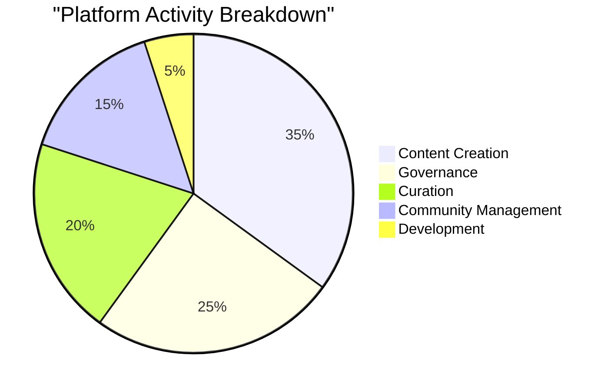

# Reimagining Social Networks

Common Ground is building the first truly user-owned social network, putting **community ownership** at the heart of social media.

## Key Metrics (Q4 2023)

| Metric | Value | Growth |
|--------|--------|--------|
| Active Communities | 150+ | ↑ 45% QoQ |
| Total Members | 25,000 | ↑ 78% QoQ |
| Avg. Daily Posts | 3,200 | ↑ 92% QoQ |
| Governance Participation | 67% | ↑ 23% QoQ |

## Community Engagement Distribution

## Growth Trajectory

<svg width="400" height="200" viewBox="0 0 400 200">
  <!-- Grid -->
  <path d="M50 150 L350 150" stroke="#ccc" stroke-width="1"/>
  <path d="M50 100 L350 100" stroke="#ccc" stroke-width="1"/>
  <path d="M50 50 L350 50" stroke="#ccc" stroke-width="1"/>
  
  <!-- Growth Line -->
  <path d="M50 150 L125 120 L200 100 L275 60 L350 20" 
        fill="none" 
        stroke="#4CAF50" 
        stroke-width="3"/>
  
  <!-- Data Points -->
  <circle cx="50" cy="150" r="4" fill="#4CAF50"/>
  <circle cx="125" cy="120" r="4" fill="#4CAF50"/>
  <circle cx="200" cy="100" r="4" fill="#4CAF50"/>
  <circle cx="275" cy="60" r="4" fill="#4CAF50"/>
  <circle cx="350" cy="20" r="4" fill="#4CAF50"/>
</svg>

> "We're not just building another social network - we're creating a new paradigm for digital communities where users truly own their platform." 
> — *Common Ground Team*