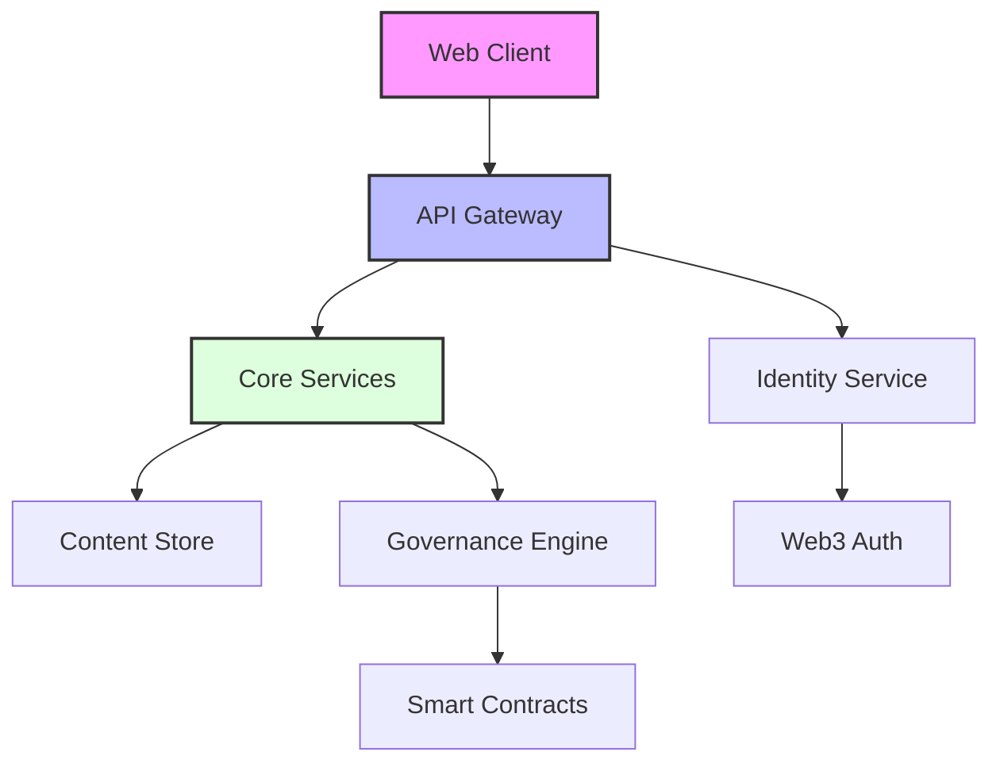

# Platform Architecture & Capabilities

## System Architecture

## Feature Matrix

| Category | Feature | Status | Release |
|----------|---------|--------|----------|
| Authentication | Web3 Login | ✅ Live | Q3 2023 |
| | Social Recovery | 🚧 Beta | Q1 2024 |
| Content | Decentralized Storage | ✅ Live | Q3 2023 |
| | Content Encryption | ✅ Live | Q4 2023 |
| Governance | DAO Framework | ✅ Live | Q3 2023 |
| | Proposal System | ✅ Live | Q4 2023 |
| | Treasury Management | 🚧 Beta | Q1 2024 |

## Performance Metrics

<svg width="400" height="200" viewBox="0 0 400 200">
  <!-- Background -->
  <rect width="400" height="200" fill="#f8f9fa"/>
  
  <!-- Bars -->
  <g transform="translate(50, 20)">
    <!-- Response Time -->
    <rect x="0" y="0" width="300" height="30" fill="#e9ecef"/>
    <rect x="0" y="0" width="270" height="30" fill="#4CAF50"/>
    <text x="310" y="20" font-family="Arial" font-size="12">90%</text>
    
    <!-- Uptime -->
    <rect x="0" y="40" width="300" height="30" fill="#e9ecef"/>
    <rect x="0" y="40" width="297" height="30" fill="#2196F3"/>
    <text x="310" y="60" font-family="Arial" font-size="12">99%</text>
    
    <!-- Data Availability -->
    <rect x="0" y="80" width="300" height="30" fill="#e9ecef"/>
    <rect x="0" y="80" width="285" height="30" fill="#FFC107"/>
    <text x="310" y="100" font-family="Arial" font-size="12">95%</text>
  </g>
  
  <!-- Labels -->
  <text x="40" y="35" font-family="Arial" font-size="12" text-anchor="end">Response</text>
  <text x="40" y="75" font-family="Arial" font-size="12" text-anchor="end">Uptime</text>
  <text x="40" y="115" font-family="Arial" font-size="12" text-anchor="end">Data</text>
</svg>

## Tech Stack Highlights

- **Frontend**: React, TypeScript, TailwindCSS
- **Backend**: Node.js, GraphQL, PostgreSQL
- **Blockchain**: Ethereum, IPFS
- **Infrastructure**: AWS, Terraform
- **Security**: End-to-end encryption, Multi-sig wallets