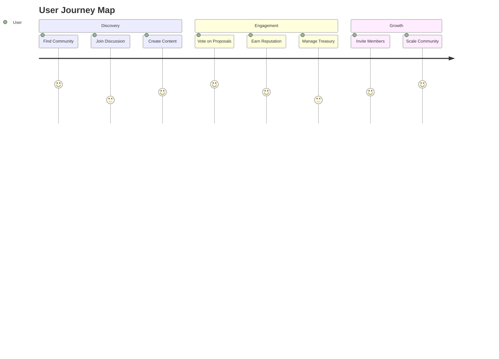

# Product Overview

## User Interface

## Key Features

### 1. Community Spaces
- **Customizable Forums** with role-based access
- **Live Chat** with end-to-end encryption
- **Media Sharing** with IPFS storage
- **Event Calendar** with token-gated access

### 2. Governance Tools
- **Proposal Creation** with markdown support
- **Voting System** with quadratic voting
- **Treasury Management** with multi-sig
- **Role Management** with programmable permissions

### 3. Analytics Dashboard

<svg width="400" height="250" viewBox="0 0 400 250">
  <!-- Background Grid -->
  <defs>
    <pattern id="grid" width="40" height="40" patternUnits="userSpaceOnUse">
      <path d="M 40 0 L 0 0 0 40" fill="none" stroke="#f0f0f0" stroke-width="1"/>
    </pattern>
  </defs>
  <rect width="400" height="250" fill="url(#grid)"/>
  
  <!-- Data Series -->
  <g transform="translate(40, 200) scale(1, -1)">
    <!-- Posts -->
    <path d="M0,0 L60,80 L120,120 L180,90 L240,150 L300,180" 
          fill="none" stroke="#FF6B6B" stroke-width="2"/>
    
    <!-- Comments -->
    <path d="M0,20 L60,60 L120,100 L180,150 L240,170 L300,200" 
          fill="none" stroke="#4ECDC4" stroke-width="2"/>
    
    <!-- Votes -->
    <path d="M0,10 L60,40 L120,80 L180,120 L240,140 L300,160" 
          fill="none" stroke="#45B7D1" stroke-width="2"/>
  </g>
  
  <!-- Legend -->
  <g transform="translate(320, 20)">
    <circle cx="10" cy="10" r="4" fill="#FF6B6B"/>
    <text x="20" y="15" font-family="Arial" font-size="12">Posts</text>
    
    <circle cx="10" cy="30" r="4" fill="#4ECDC4"/>
    <text x="20" y="35" font-family="Arial" font-size="12">Comments</text>
    
    <circle cx="10" cy="50" r="4" fill="#45B7D1"/>
    <text x="20" y="55" font-family="Arial" font-size="12">Votes</text>
  </g>
</svg>

## Engagement Metrics

| Metric | Last Month | This Month | Growth |
|--------|------------|------------|--------|
| Daily Active Users | 12,500 | 15,750 | +26% |
| Posts Created | 45,000 | 62,300 | +38% |
| Proposals Submitted | 280 | 425 | +52% |
| Votes Cast | 8,900 | 12,400 | +39% |

> "The platform's intuitive design combined with powerful governance tools creates an unmatched community experience."
> — *Early User Feedback*