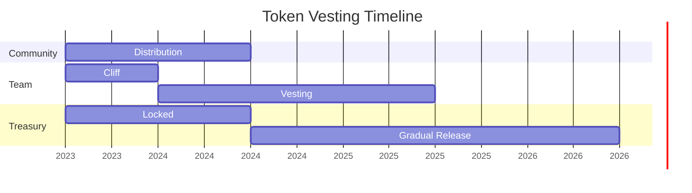

# Co-Ownership & Tokenomics

## Token Distribution

<svg width="400" height="400" viewBox="0 0 400 400">
  <!-- Donut Chart -->
  <g transform="translate(200, 200)">
    <!-- Community (40%) -->
    <path d="M0 0 L200 0 A200 200 0 0 1 123.6 158.8 L0 0" fill="#4CAF50"/>
    <!-- Team (20%) -->
    <path d="M0 0 L123.6 158.8 A200 200 0 0 1 -76.4 184.8 L0 0" fill="#2196F3"/>
    <!-- Treasury (25%) -->
    <path d="M0 0 L-76.4 184.8 A200 200 0 0 1 -200 0 L0 0" fill="#FFC107"/>
    <!-- Investors (15%) -->
    <path d="M0 0 L-200 0 A200 200 0 0 1 200 0 L0 0" fill="#9C27B0"/>
  </g>
  
  <!-- Legend -->
  <g transform="translate(20, 20)">
    <rect x="0" y="0" width="15" height="15" fill="#4CAF50"/>
    <text x="25" y="12" font-family="Arial" font-size="12">Community (40%)</text>
    
    <rect x="0" y="25" width="15" height="15" fill="#2196F3"/>
    <text x="25" y="37" font-family="Arial" font-size="12">Team (20%)</text>
    
    <rect x="0" y="50" width="15" height="15" fill="#FFC107"/>
    <text x="25" y="62" font-family="Arial" font-size="12">Treasury (25%)</text>
    
    <rect x="0" y="75" width="15" height="15" fill="#9C27B0"/>
    <text x="25" y="87" font-family="Arial" font-size="12">Investors (15%)</text>
  </g>
</svg>

## Vesting Schedule

## Governance Structure

| Level | Requirements | Rights | Active Members |
|-------|-------------|--------|----------------|
| Level 1 | Hold 1000+ CGT | Vote on Proposals | 15,000 |
| Level 2 | Hold 5000+ CGT | Create Proposals | 5,000 |
| Level 3 | Hold 10000+ CGT | Manage Treasury | 1,000 |
| Guardian | Hold 50000+ CGT | Emergency Actions | 100 |

## Treasury Allocation

### Current Holdings
- **ETH**: 1,250
- **USDC**: 2.5M
- **CGT**: 25M (locked)

### Monthly Burn Rate
<svg width="400" height="150" viewBox="0 0 400 150">
  <!-- Stacked Bar -->
  <g transform="translate(50, 20)">
    <!-- Development -->
    <rect x="0" y="0" width="120" height="30" fill="#4CAF50"/>
    <text x="60" y="20" font-family="Arial" font-size="12" fill="white" text-anchor="middle">Dev (40%)</text>
    
    <!-- Marketing -->
    <rect x="120" y="0" width="90" height="30" fill="#2196F3"/>
    <text x="165" y="20" font-family="Arial" font-size="12" fill="white" text-anchor="middle">Marketing (30%)</text>
    
    <!-- Operations -->
    <rect x="210" y="0" width="60" height="30" fill="#FFC107"/>
    <text x="240" y="20" font-family="Arial" font-size="12" fill="black" text-anchor="middle">Ops (20%)</text>
    
    <!-- Reserve -->
    <rect x="270" y="0" width="30" height="30" fill="#9C27B0"/>
    <text x="285" y="20" font-family="Arial" font-size="12" fill="white" text-anchor="middle">Res</text>
  </g>
</svg>

> "Our co-ownership model ensures that those who contribute the most to the platform have the strongest voice in its future."